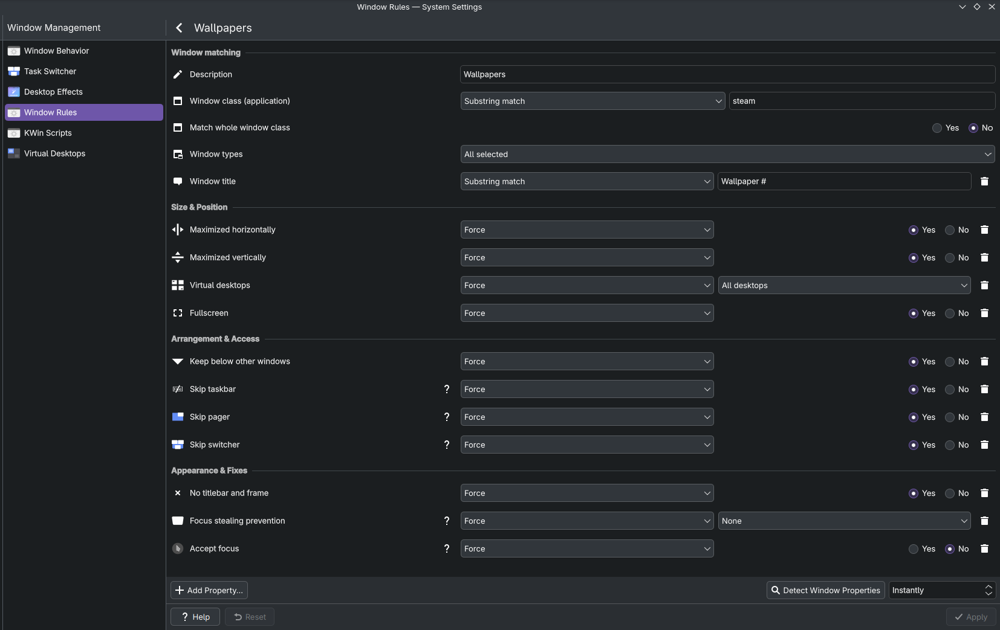

# wallpaper_engine_xwayland

Runs Wallpaper Engine through Proton by using the `-control openWallpaper` feature.

This enables features such as audio visualization and better rendering.

https://github.com/user-attachments/assets/3393e593-0b6c-4bed-a204-eacb67d7788d

## Requirements

You need to own Wallpaper Engine through Steam and have both installed.

This assumes your Steam library is available in `~/.steam`.

If you installed via Flatpak this may not work.

### Arch

```bash
sudo pacman -S xdotool imagemagick chafa
```

## Installation

Currently [Rust](https://www.rust-lang.org/) is required to install.

```bash
cargo install --git https://github.com/kyza/wallpaper_engine_xwayland
```

It's now available as `wex`.

## Usage

### Window Rules

In the future this might set window rules itself, but for now you have to set them yourself.

Each one is named `Wallpaper #N` where `N` is the index of the monitor it's meant for (starting at 0).

Set the windows to display behind, not activate, be borderless, skip taskbar, all virtual desktops, etc...

On KDE I made one rule matching `class substring "steam"` `title substring "Wallpaper #"` for setting the duplicate rules, then one for each `title substring "Wallpaper #N"` to set the monitor they should be on.



If your WM doesn't support running commands and only lets you run scripts like KDE, try [`autostart.sh`](./autostart.sh).

### Launching

Specify the Proton folder name, the architecture, and the wallpaper IDs.

Proton folders are stored in `~/.steam/steam/compatibilitytools.d/` and `~/.steam/steam/steamapps/common/`.

Wallpaper IDs are the folder names in `~/.steam/steam/steamapps/workshop/content/431960/`.

```bash
wex -p "Proton 10.0" --arch 32 -w 3428443753 -w 2740495762 -w 3480481965
```

## FAQ

### My cursor is gone/incorrect!!

Yeah.

There might be a Proton setting to fix this but I couldn't find anything.

Don't worry, it's only invisible when your mouse is over the background.

Sometimes your cursor comes back randomly like magic! I think it's just hiding.

### The wallpapers are black.

Try 64 instead of 32 or the other way around.

### The wallpapers don't pause when something covers them.

Unfortunately because `-control openWallpaper` opens them in a separate window there's no detection logic for this.

Be sure to keep your performance settings reasonable.

### Why is this useful?

The reimplementations of Wallpaper Engine have imperfect rendering and featuresets.

[catsout/wallpaper-engine-kde-plugin](https://github.com/catsout/wallpaper-engine-kde-plugin) was causing KDE to crash loop for me on newer wallpapers so I wrote this.
